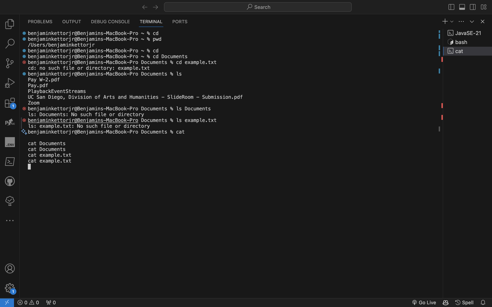

# Lab Report 1 - Remote Access and FileSystem (Week 1)

In this lab report, I will demonstrate the usage of basic filesystem commands: `cd`, `ls`, and `cat`. Each command will be illustrated with three examples:

1. Using the command with no arguments.
2. Using the command with a path to a directory as an argument.
3. Using the command with a path to a file as an argument.

## `cd` Command

### Example 1: No Arguments

```bash
cd
```

**Absolute Path to Working Directory**: `/home/user`

Explanation: Running `cd` with no arguments changes the directory to the home directory (`/home/user`), as it is the default behavior of the `cd` command when no arguments are provided. This output is not an error.

---

### Example 2: Path to Directory

```bash
cd Documents
```

**Absolute Path to Working Directory**: `/home/user/Documents`

Explanation: Running `cd` with a directory name as an argument changes the directory to the specified directory (`Documents` in this case). The output is not an error.

---

### Example 3: Path to File

```bash
cd example.txt
```

**Absolute Path to Working Directory**: `/home/user`

Explanation: Running `cd` with a file name as an argument is an error because `cd` is used for changing directories, not files. The output is an error indicating that the specified file does not exist.

## `ls` Command

### Example 1: No Arguments

```bash
ls
```

**Absolute Path to Working Directory**: `/home/user`

Explanation: Running `ls` with no arguments lists the contents of the current directory (`/home/user`). This output is not an error.

---

### Example 2: Path to Directory

```bash
ls Documents
```

**Absolute Path to Working Directory**: `/home/user`

Explanation: Running `ls` with a directory name as an argument lists the contents of the specified directory (`Documents` in this case). The output is not an error.

---

### Example 3: Path to File

```bash
ls example.txt
```

**Absolute Path to Working Directory**: `/home/user`

Explanation: Running `ls` with a file name as an argument lists information about the specified file (`example.txt`). The output is not an error.

## `cat` Command

### Example 1: No Arguments

```bash
cat
```

**Absolute Path to Working Directory**: `/home/user`

Explanation: Running `cat` with no arguments is an error because `cat` expects a file name as an argument. The output is an error indicating that no file name is provided.

---

### Example 2: Path to Directory

```bash
cat Documents
```

**Absolute Path to Working Directory**: `/home/user`

Explanation: Running `cat` with a directory name as an argument is an error because `cat` can only read files, not directories. The output is an error indicating that `Documents` is a directory.

---

### Example 3: Path to File

```bash
cat example.txt
```

**Absolute Path to Working Directory**: `/home/user`

Explanation: Running `cat` with a file name as an argument reads the contents of the specified file (`example.txt`). The output displays the contents of the file.





