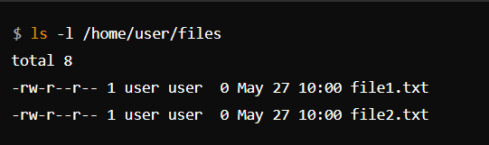
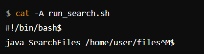
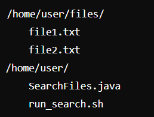

# Lab Report 5 - Putting it All Together (Week 9)

## Part 1- Debugguing Scenario

## Original Post from Student
### Subject: [Debugging Help] Unexpected Output in Java Program

Hi everyone,

I'm having some trouble with my java program from the files searching system assignment. When I run my program, it doesn't seem to be finding any files, even though I know the files are there. Here's a screenshot of my terminal output and my code. I suspect the issue might be with how I'm reading the directories, but I'm not sure.

## Screenshot 1: Terminal Output


## Java Code (SearchFiles.java)

```java

import java.io.File;

public class SearchFiles {
    public static void main(String[] args) {
        if (args.length < 1) {
            System.out.println("Please provide a directory to search.");
            return;
        }
        
        File dir = new File(args[0]);
        if (!dir.exists() || !dir.isDirectory()) {
            System.out.println("Directory does not exist.");
            return;
        }
        
        File[] files = dir.listFiles();
        if (files == null || files.length == 0) {
            System.out.println("No files found.");
        } else {
            for (File file : files) {
                System.out.println("Found file: " + file.getName());
            }
        }
    }
}
```
Any ideas on what might be going wrong?

## Response from TA

Hi John,

Thanks for sharing the details. It looks like your code should be listing files in the specified directory, but it's not finding any files. Could you try running the following command and share the output with us?


This will help us verify if there are files in the directory and if there might be any permission issues.

## Follow-up Post from Student

Sure, I ran the command you suggested. Here’s the output:


## Screenshot 2: Terminal Output After Running `ls` Command



So it looks like the files are definitely there. What could be the issue?

## Response from TA

Thanks for the output. It looks like the files are present in the directory. One possibility is that your script might not be passing the directory argument correctly to the Java program. Could you share the content of your `run_search.sh` script?

## Follow-up Post from Student
Here’s the content of my run_search.sh script:


## Response from TA

Thanks for sharing that. The script looks correct, but to troubleshoot further, let's add some debug prints to your Java program to ensure the argument is being passed correctly. Modify your SearchFiles.java file like this:

```java
import java.io.File;

public class SearchFiles {
    public static void main(String[] args) {
        if (args.length < 1) {
            System.out.println("Please provide a directory to search.");
            return;
        }
        
        System.out.println("Searching in directory: " + args[0]);
        
        File dir = new File(args[0]);
        if (!dir.exists() || !dir.isDirectory()) {
            System.out.println("Directory does not exist.");
            return;
        }
        
        File[] files = dir.listFiles();
        if (files == null || files.length == 0) {
            System.out.println("No files found.");
        } else {
            for (File file : files) {
                System.out.println("Found file: " + file.getName());
            }
        }
    }
}
```

Run your script again and see what the output is.

## Follow-up Post from Student

I added the debug print and ran the script again. Here’s the output:

## Screenshot 3: Terminal Output After Adding Debug Print


Looks like the directory isn’t being recognized correctly. What should I do next?

## Response from TA

Great, the debug print helped us identify the issue. It looks like there might be an extra whitespace character in your script or a typo in the directory path. Double-check that the path is correct and doesn't contain any hidden characters or typos. Try copying the path directly from your ls command output.

Additionally, let's check for any hidden characters in your script using the cat -A command:


## Follow-up Post from Student

I ran the cat -A command, and here's the output:

## Screenshot 4: Terminal Output After Running cat -A Command



It looks like there's a ^M character at the end of the line. Could that be the problem?

## Response from TA

Yes, the ^M character is a carriage return that is often found in scripts edited on Windows. This can cause issues when running the script on Unix-based systems. To remove it, you can use the `dos2unix` command:


After running this command, try executing your script again.

## Follow-up Post from Student

I ran the dos2unix command and then executed the script again. Now it works perfectly!

## Screenshot 5: Terminal Output After Fixing the Bug


Thank you so much for your help!

# Setup Information
- File & Directory Structure:
  
    

    - **Contents of Each File Before Fixing the Bug:**
  
      SearchFiles.java:

```java 
        import java.io.File;

public class SearchFiles {
    public static void main(String[] args) {
        if (args.length < 1) {
            System.out.println("Please provide a directory to search.");
            return;
        }
        
        File dir = new File(args[0]);
        if (!dir.exists() || !dir.isDirectory()) {
            System.out.println("Directory does not exist.");
            return;
        }
        
        File[] files = dir.listFiles();
        if (files == null || files.length == 0) {
            System.out.println("No files found.");
        } else {
            for (File file : files) {
                System.out.println("Found file: " + file.getName());
            }
        }
    }
}
```
## run_search.sh:


- ## Full Command Line to Trigger the Bug:


- ## Description of What to Edit to Fix the Bug:

- Use the `dos2unix` command to remove the carriage return characters (^M) from the `run_search.sh` script.


    
## Part 2 – Reflection
One thing I learned from my lab experience in the second half of this quarter is how to use debugging tools and techniques effectively to diagnose and fix issues in my code. For example, I learned how to add debug prints to track the flow of my program and identify where things might be going wrong. I also discovered the importance of checking for hidden characters or formatting issues, especially when working with scripts across different operating systems. This has made me more confident in my problem-solving skills and my ability to troubleshoot complex issues.
